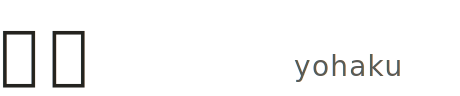

<p align="center">
  <picture>
    <source media="(prefers-color-scheme: dark)" srcset="./assets/logo/wordmark-dark.svg">
    
  </picture>
</p>

**[简体中文](./README.md) · [English](./README.en.md) · [日本語](./README.ja.md)**

> *The blank space is part of the writing.*

**Yohaku** (余白) is a Japanese word meaning *negative space* — the intentional emptiness that gives everything else its weight.

This is a **typographic design system for written content**: one accent, three neutral tiers, the rest is whitespace. Web pages, long-form, letters, reports — anywhere words live.

- Live showcase: **[yohaku.innei.dev](https://yohaku.innei.dev)**
- The design contract (tokens, templates, AI skill) lives in [`design-system/`](./design-system/) and is released under MIT.
- The screenshots below are how the system looks once shipped on the [Yohaku personal site](https://github.com/Innei-dev/Yohaku).

> Each preview is split diagonally — light on the top-left, dark on the bottom-right.


---

## Principles

The whole system is built around **writing**. A page unfolds like a letter opening — text and silence form the rhythm, never crammed into a rigid grid. When you read, your eyes lead. The page follows.

**Color is restrained.** Light mode sits near the off-white of real paper. Dark mode sinks into warm gray, like reading by a small lamp at night. Accent appears only inside content; buttons, navigation, borders all step back.

**Animation breathes.** Content surfaces with the scroll rather than popping in — like turning a fresh page. First visit plays the full entrance; return visits skip it.

**Type has texture.** Headings carry the weight of serif ink; annotations and dates use italic serif, like margin notes. The base size is deliberately small. Space goes back to the content.

**Interaction is quiet.** No floating color blocks, no jumping highlights. Hover deepens color slightly — like a finger pressing on paper. Every response says *I noticed you*, not *look here*.

---

## See it · output samples

`pnpm demo:pdf` renders three common written formats from the same tokens — same paper, same serif, same breathing rhythm.

| Type | About | 中文 | English |
|------|-------|------|---------|
| **Long-form post** | Serif body / drop cap / multi-page | [HTML](https://yohaku.innei.dev/demos/demo-post.html) · [PDF](https://yohaku.innei.dev/demos/demo-post.pdf) | [HTML](https://yohaku.innei.dev/demos/demo-post.en.html) · [PDF](https://yohaku.innei.dev/demos/demo-post.en.pdf) |
| **Resume** | A4 single page · designer-engineer CV | [HTML](https://yohaku.innei.dev/demos/demo-resume.html) · [PDF](https://yohaku.innei.dev/demos/demo-resume.pdf) | [HTML](https://yohaku.innei.dev/demos/demo-resume.en.html) · [PDF](https://yohaku.innei.dev/demos/demo-resume.en.pdf) |
| **One-page report** | A4 single page · project status | [HTML](https://yohaku.innei.dev/demos/demo-report.html) · [PDF](https://yohaku.innei.dev/demos/demo-report.pdf) | [HTML](https://yohaku.innei.dev/demos/demo-report.en.html) · [PDF](https://yohaku.innei.dev/demos/demo-report.en.pdf) |

You can also flip through them in the *Output samples* section on [yohaku.innei.dev](https://yohaku.innei.dev).

---

## How to use

### Install as a package

```bash
pnpm add @yohaku/design-system
```

```css
/* in your Tailwind v4 entry CSS */
@import "@yohaku/design-system/tokens.css";
```

That single import wires up the color / type / spacing tokens — pair it with the invariants in [`design-system/CHEATSHEET.md`](./design-system/CHEATSHEET.md).

### Local preview

```bash
pnpm install
pnpm dev             # local showcase preview (http://localhost:5173)
pnpm build           # bundle the showcase to design-system/showcase/dist
pnpm check           # token drift + template lint
pnpm test            # run the check.ts unit tests
pnpm demo:pdf        # render the demo essay / résumé / report to PDF
```

Map of what's inside:

| Path | Purpose |
|------|---------|
| `design-system/src/tokens.css` | Color / type / spacing tokens (Tailwind v4 `@theme`) |
| `design-system/SKILL.md` | AI routing rules (mockup / new component / mockup→React / token audit) |
| `design-system/CHEATSHEET.md` | One-page reference: ten invariants + color/type tables |
| `design-system/references/` | Full specs (tokens / components / anti-patterns / mockup-to-react) |
| `design-system/templates/` | HTML mockup starter |
| `design-system/showcase/` | Live showcase source |

### As an AI skill

[`design-system/SKILL.md`](./design-system/SKILL.md) is a routing contract for agents like Claude Code or Codex. When you say *"make a Yohaku mockup"*, *"convert this mockup to React"*, or *"audit token compliance"*, it pulls the right slice of `CHEATSHEET.md`, `references/`, and `templates/` into context so the agent ships against the same tokens.

The simplest install is to drop the whole `design-system/` directory into your agent's skill path (e.g. `~/.claude/skills/yohaku-design/`), then trigger it from a normal prompt:

- make a Yohaku-style mockup for X
- convert this mockup to React
- design a new Button variant
- audit this file for token compliance

Full contract: [`design-system/SKILL.md`](./design-system/SKILL.md) and [`design-system/CHEATSHEET.md`](./design-system/CHEATSHEET.md).

---

## Full implementation · closed-source repo

The complete site implementation is maintained as a private repo at [Innei-dev/Yohaku](https://github.com/Innei-dev/Yohaku), deeply rebuilt from [Shiro](https://github.com/Innei/Shiro).

**Sponsorship grants access.**

[](https://github.com/sponsors/Innei)

After sponsoring at [github.com/sponsors/Innei](https://github.com/sponsors/Innei), open an [Issue](https://github.com/Innei/Yohaku/issues) or send an email with your GitHub username — I'll add you to the repository manually.

---

## Spec at a glance

| Token | Light | Dark |
|-------|-------|------|
| Accent | 浅葱 `#33A6B8` | 桃 `#F596AA` |
| Surface | `#fefefb` (paper white) | `rgb(28,28,30)` (warm night) |
| Neutral | `1–10` (three tiers: surface / border / text) | auto-inverts |
| Easing | `cubic-bezier(0.22, 1, 0.36, 1)` | same |
| Base font size | 14px | same |

More in [`design-system/CHEATSHEET.md`](./design-system/CHEATSHEET.md).

---

## Background

Yohaku wasn't designed from scratch — it was filed down inside my own blog [Shiro](https://github.com/Innei/Shiro), one decision at a time. The original itch was just typography: replace the template-y card grid with something closer to letter paper, and let long-form text breathe. The longer I worked on it, the more obvious it became that the system was running on a few simple invariants — one accent, three neutral tiers, a breathing easing curve, and the rest is whitespace.

Later I came across [tw93/kami](https://github.com/tw93/kami) — same instinct: a constraint language, a single tonal register, and a bias toward the written word. Kami lands in static documents (PDFs, slides); Yohaku lands in webpages and long-form. Each one was a sanity check on the other. Pulling those invariants out of the application — into tokens, templates, and an AI skill — is what the design-system became: a contract you can hand to an agent or to another human and trust the output.

---

## Dev chats (open archive)

While building Yohaku, the AI-assisted chats were often more useful than the final code, so I'm sharing them in [archive/specstory-sessions](./archive/specstory-sessions/README.md), grouped by year.

---

## Related projects

- [Shiro](https://github.com/Innei/Shiro) — open-source predecessor, Next.js personal blog system
- [Innei-dev/Yohaku](https://github.com/Innei-dev/Yohaku) — full closed-source implementation (sponsor for access)

---

## Acknowledgements

- The design-system's HTML design language was inspired by [tw93/kami](https://github.com/tw93/kami) — its writing-first, restrained-whitespace sensibility is an important starting point for Yohaku's typography.

---

## License

2026 Innei.

- Code under `design-system/` (tokens, scripts, showcase, templates) is released under the [MIT License](./design-system/LICENSE).
- The rest of the repository (README, screenshots, chat archives, etc.) remains under [CC BY-NC-SA 4.0](https://creativecommons.org/licenses/by-nc-sa/4.0/).
