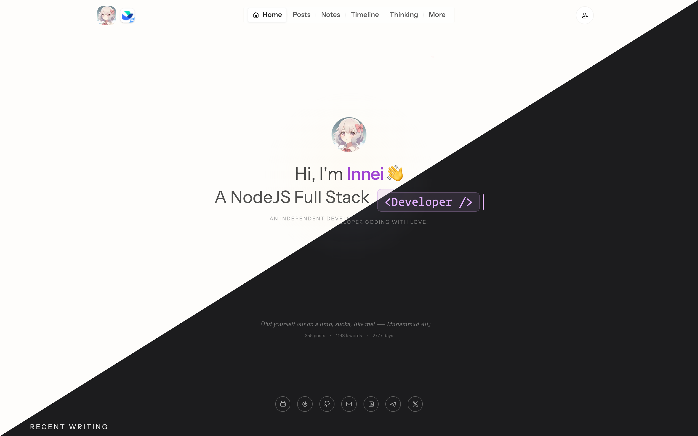
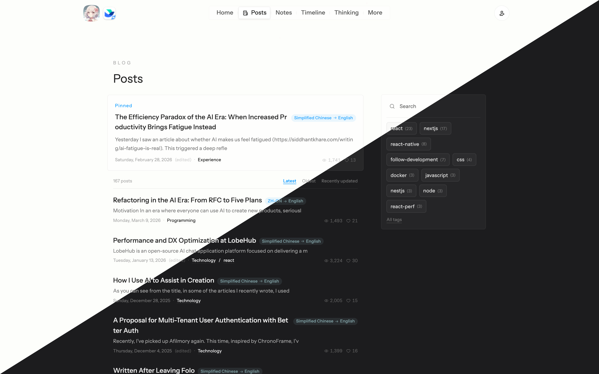
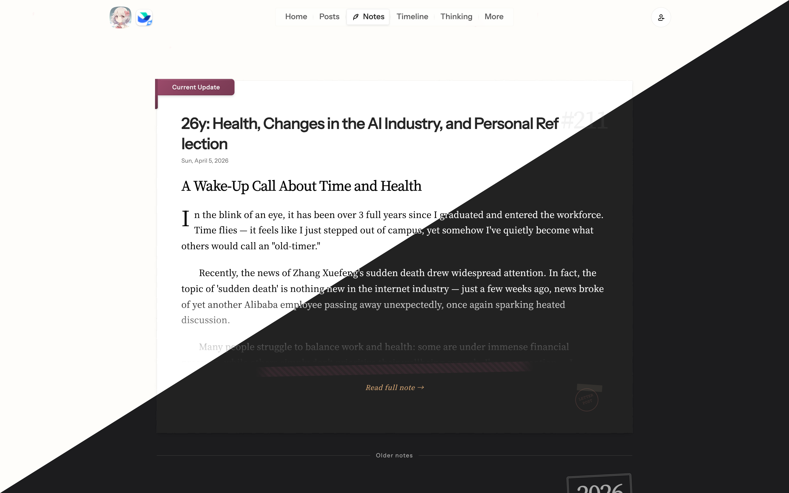
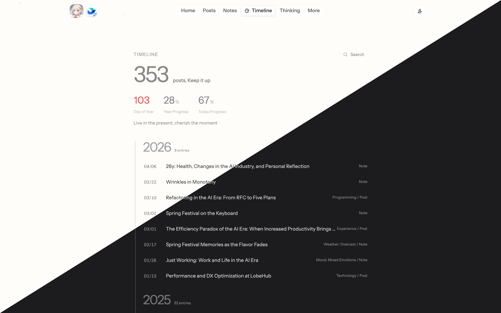
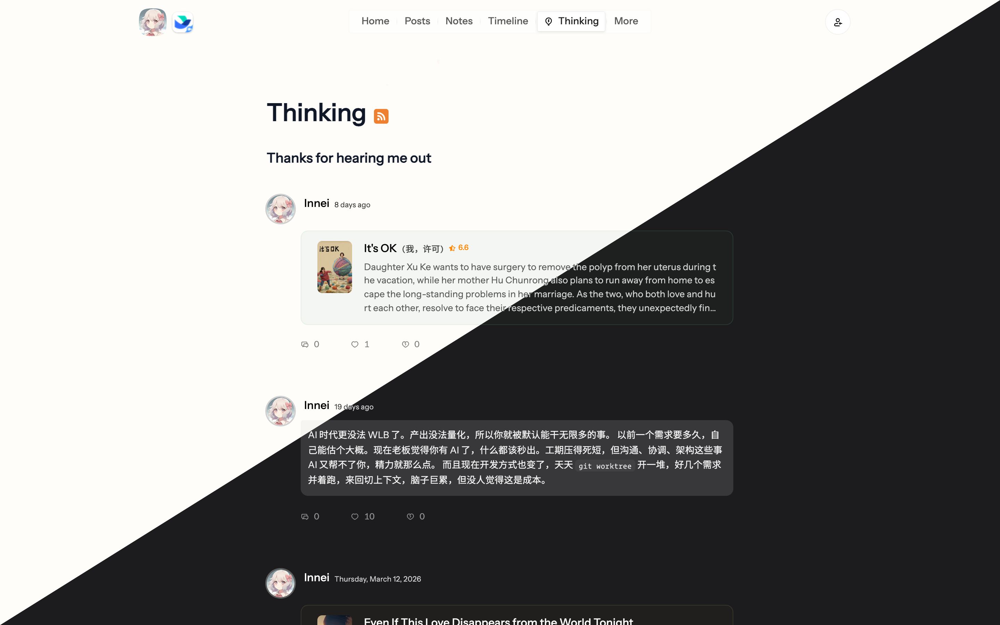

# 余白 / Yohaku

**[简体中文](./README.md) · [English](./README.en.md) · [日本語](./README.ja.md)**

> *The blank space is part of the writing.*

**Yohaku** (余白) is a Japanese word meaning *negative space* — the intentional emptiness that gives everything else its weight.

This is a **typographic design system for written content**: one accent, three neutral tiers, the rest is whitespace. Web pages, long-form, letters, reports — anywhere words live.

- Live showcase: **[yohaku.innei.dev](https://yohaku.innei.dev)**
- The design contract (tokens, templates, AI skill) lives in [`design-system/`](./design-system/) and is released under MIT.
- The screenshots below are how the system looks once shipped on the [Yohaku personal site](https://github.com/Innei-dev/Yohaku).

> Each preview is split diagonally — light on the top-left, dark on the bottom-right.











---

## Principles

The whole system is built around **writing**. A page unfolds like a letter opening — text and silence form the rhythm, never crammed into a rigid grid. When you read, your eyes lead. The page follows.

**Color is restrained.** Light mode sits near the off-white of real paper. Dark mode sinks into warm gray, like reading by a small lamp at night. Accent appears only inside content; buttons, navigation, borders all step back.

**Animation breathes.** Content surfaces with the scroll rather than popping in — like turning a fresh page. First visit plays the full entrance; return visits skip it.

**Type has texture.** Headings carry the weight of serif ink; annotations and dates use italic serif, like margin notes. The base size is deliberately small. Space goes back to the content.

**Interaction is quiet.** No floating color blocks, no jumping highlights. Hover deepens color slightly — like a finger pressing on paper. Every response says *I noticed you*, not *look here*.

---

## How to use

```bash
pnpm install
pnpm dev             # local showcase preview (http://localhost:5173)
pnpm build           # bundle the showcase to design-system/showcase/dist
pnpm check           # token drift + template lint
pnpm test            # run the check.ts unit tests
pnpm demo:pdf        # render the demo essay / résumé / report to PDF
```

Map of what's inside:

| Path | Purpose |
|------|---------|
| `design-system/src/tokens.css` | Color / type / spacing tokens (Tailwind v4 `@theme`) |
| `design-system/SKILL.md` | AI routing rules (mockup / new component / mockup→React / token audit) |
| `design-system/CHEATSHEET.md` | One-page reference: ten invariants + color/type tables |
| `design-system/references/` | Full specs (tokens / components / anti-patterns / mockup-to-react) |
| `design-system/templates/` | HTML mockup starter |
| `design-system/showcase/` | Live showcase source |

---

## Full implementation · closed-source repo

The complete site implementation is maintained as a private repo at [Innei-dev/Yohaku](https://github.com/Innei-dev/Yohaku), deeply rebuilt from [Shiro](https://github.com/Innei/Shiro).

**Sponsorship grants access.**

[](https://github.com/sponsors/Innei)

After sponsoring at [github.com/sponsors/Innei](https://github.com/sponsors/Innei), open an [Issue](https://github.com/Innei/Yohaku/issues) or send an email with your GitHub username — I'll add you to the repository manually.

---

## Spec at a glance

| Token | Light | Dark |
|-------|-------|------|
| Accent | 浅葱 `#33A6B8` | 桃 `#F596AA` |
| Surface | `#fefefb` (paper white) | `rgb(28,28,30)` (warm night) |
| Neutral | `1–10` (three tiers: surface / border / text) | auto-inverts |
| Easing | `cubic-bezier(0.22, 1, 0.36, 1)` | same |
| Base font size | 14px | same |

More in [`design-system/CHEATSHEET.md`](./design-system/CHEATSHEET.md).

---

## Dev chats (open archive)

While building Yohaku, the AI-assisted chats were often more useful than the final code, so I'm sharing them in [archive/specstory-sessions](./archive/specstory-sessions/README.md), grouped by year.

---

## Related projects

- [Shiro](https://github.com/Innei/Shiro) — open-source predecessor, Next.js personal blog system
- [Innei-dev/Yohaku](https://github.com/Innei-dev/Yohaku) — full closed-source implementation (sponsor for access)

---

## License

2026 Innei.

- Code under `design-system/` (tokens, scripts, showcase, templates) is released under the [MIT License](./design-system/LICENSE).
- The rest of the repository (README, screenshots, chat archives, etc.) remains under [CC BY-NC-SA 4.0](https://creativecommons.org/licenses/by-nc-sa/4.0/).
