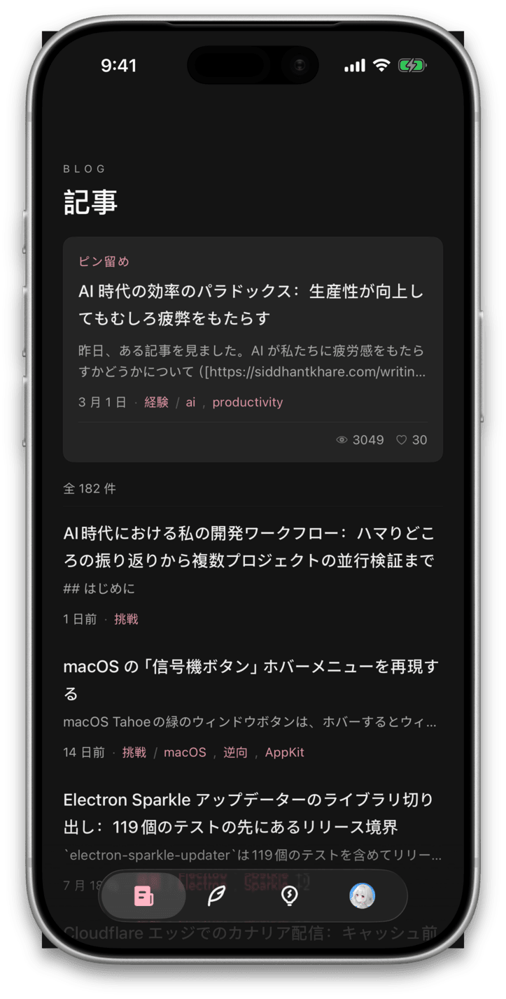
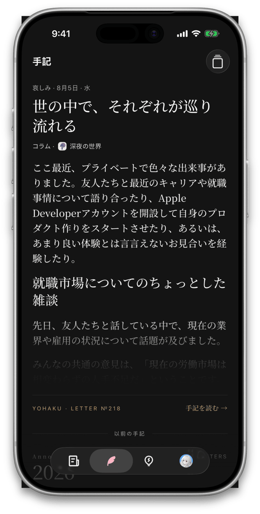
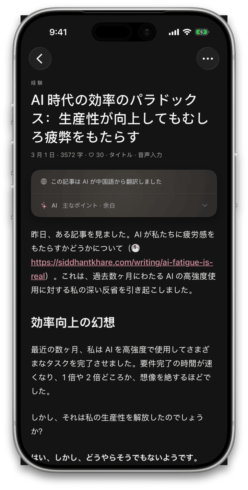
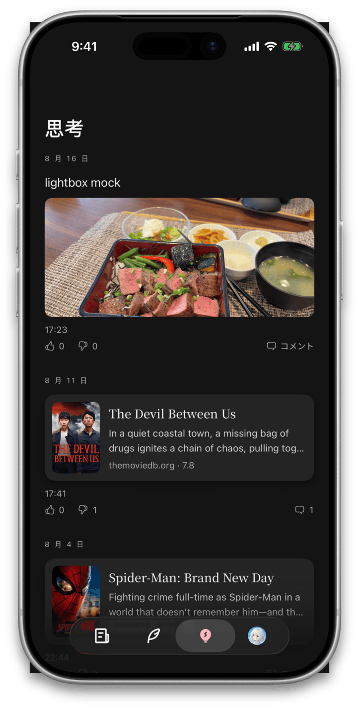

<p align="center">
  
</p>

<p align="center">
  <picture>
    <source media="(prefers-color-scheme: dark)" srcset="./assets/logo/wordmark-dark.svg">
    
  </picture>
</p>

<p align="center">
  <strong>iOS 18+</strong> · Expo · MIT · no Android
</p>

**[简体中文](./README.md) · [English](./README.en.md) · [日本語](./README.ja.md)**

> *The blank space is part of the writing.*

An **iOS reader** for your own [Mix Space](https://github.com/mx-space) site. Four tabs: Posts, Notes, Thoughts, Me. Article bodies use the same typography as the website. Open source — point it at your [mx-core](https://github.com/mx-space/core) and compile locally.

It is not a multi-site product. There is no first-launch “connect your site” flow.

<table>
  <tr>
    <td align="center"><br>Posts</td>
    <td align="center"><br>Notes</td>
  </tr>
  <tr>
    <td align="center"><br>Article</td>
    <td align="center"><br>Thoughts</td>
  </tr>
</table>

---

## The client

Source lives in [`apps/mobile/`](./apps/mobile/). How to run it: [README](./apps/mobile/README.en.md).

| Tab | What’s there |
|-----|----------------|
| **Posts** | Article list, pins, series |
| **Notes** | Note timeline, series archives |
| **Thoughts** | Short-form timeline |
| **Me** | Sign-in, likes, reading history, comments, language, push |

Also: in-app comments and likes, the same Lexical renderer as the site, local SQLite sync, narration, summaries and related reading. On iOS 26 with Liquid Glass it uses system tabs; otherwise a paper tab bar.

---

## Run it

```bash
pnpm install
# edit publicSite in apps/mobile/src/site-config.ts to point at your mx-core
pnpm --filter @yohaku/mobile start
pnpm --filter @yohaku/mobile ios   # macOS + Xcode
```

Public defaults are an empty API URL and bundle id `dev.yohaku.app`. `expo run:ios` generates a gitignored `ios/` directory. Full notes: [`apps/mobile/README.en.md`](./apps/mobile/README.en.md).

---

## Design system

The typographic contract the client uses also lives here: one accent, three neutral tiers, the rest is whitespace. Web previews, tokens, templates, and the AI skill are in [`design-system/README.md`](./design-system/README.md). Live showcase: [yohaku.innei.dev](https://yohaku.innei.dev).

---

## Full implementation · closed-source repo

The website itself is still maintained as a private repo at [Innei-dev/Yohaku](https://github.com/Innei-dev/Yohaku), deeply rebuilt from [Shiro](https://github.com/Innei/Shiro). The sponsor model is unchanged.

**Sponsorship grants access.**

[](https://github.com/sponsors/Innei)

After sponsoring at [github.com/sponsors/Innei](https://github.com/sponsors/Innei), open an [Issue](https://github.com/Innei/Yohaku/issues) or send an email with your GitHub username — I'll add you to the repository manually.

---

## Related projects

- [mx-space/core](https://github.com/mx-space/core) — backend API the client talks to
- [Shiro](https://github.com/Innei/Shiro) — open-source predecessor, Next.js personal blog system
- [Innei-dev/Yohaku](https://github.com/Innei-dev/Yohaku) — full closed-source implementation (sponsor for access)

---

## License

2026 Innei.

- `apps/mobile/` and `packages/rich-content/` are [MIT](./apps/mobile/LICENSE), copyright Innei.
- Code under `design-system/` (tokens, scripts, showcase, templates) is released under the [MIT License](./design-system/LICENSE).
- `packages/dom-webview/` keeps the upstream Expo MIT license; see [`VENDOR.md`](./packages/dom-webview/VENDOR.md) for the local changes.
- The rest of the repository (README, screenshots, chat archives, etc.) remains under [CC BY-NC-SA 4.0](https://creativecommons.org/licenses/by-nc-sa/4.0/).
