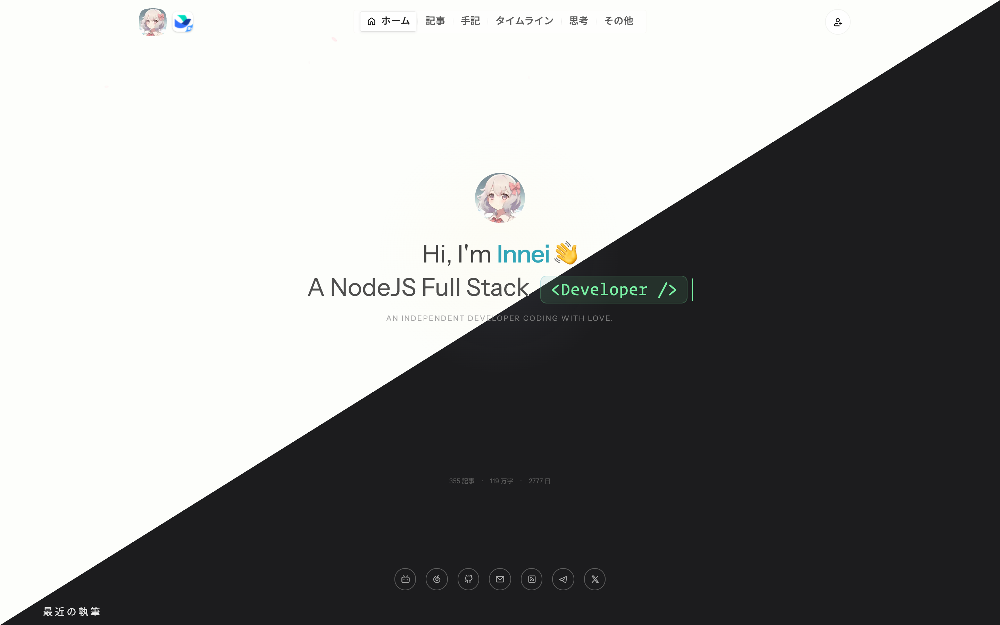
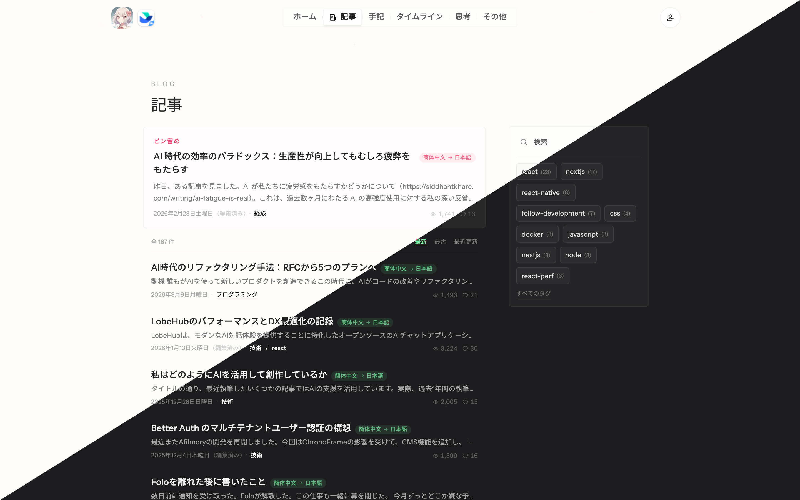
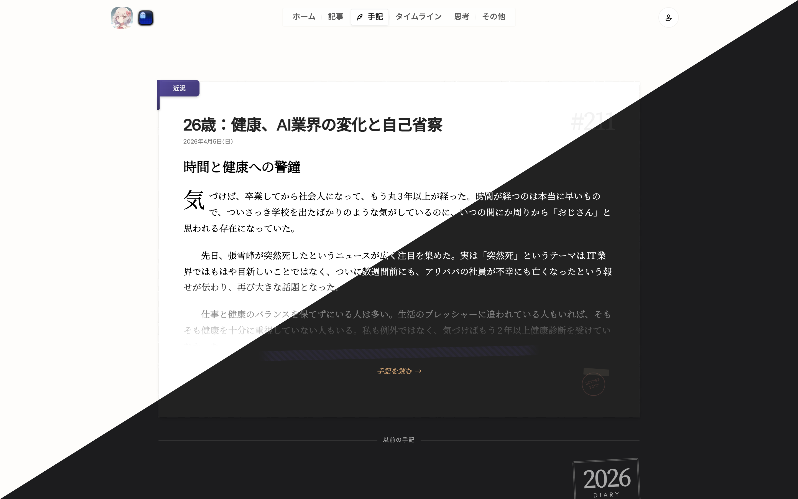
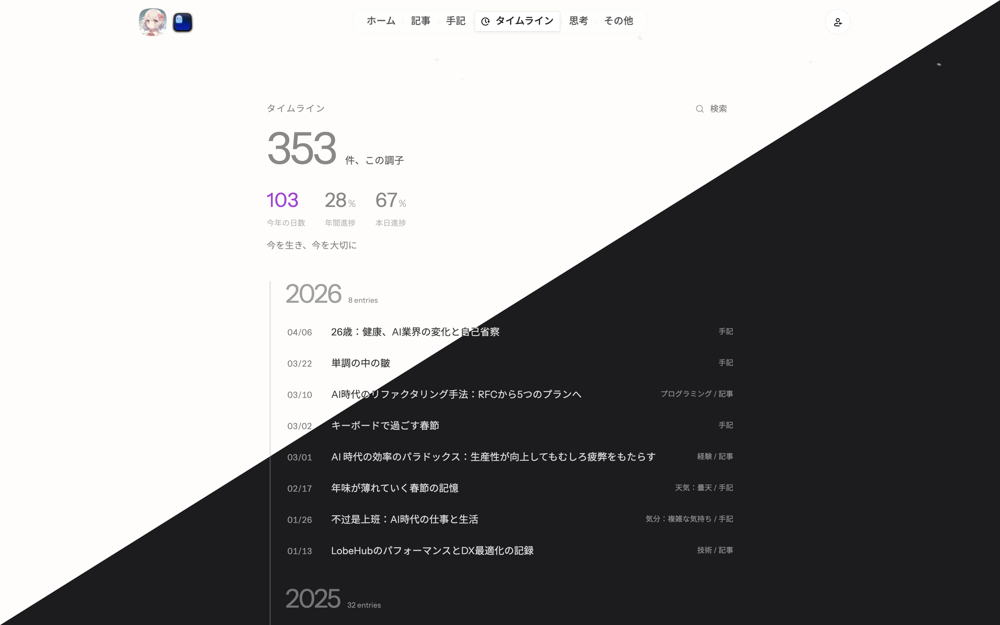
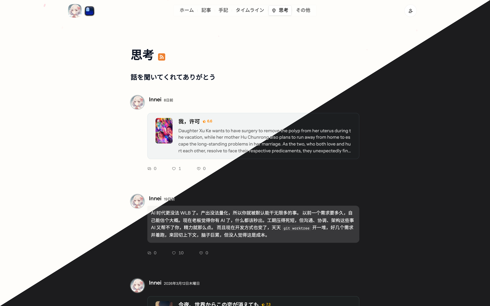

# 余白 / Yohaku

**[简体中文](./README.md) · [English](./README.en.md) · [日本語](./README.ja.md)**

> *The blank space is part of the writing.*

**余白**とは、意図的に空けられた空間のこと——埋められた部分より、空いた部分こそが重さを持つ。

これは個人ブログのためのデザイン言語とビジュアルシステムです。「書写・信紙・光影」という隐喩のもとに構築されています。機能一覧ではなく、「いかにして読書を生み出すか」という問いへの答えです。

> 下のプレビューは対角線で分割されています——左上がライト、右下がダーク。

---

## デザイン哲学

サイト全体は**個人の書き物**を隠喩としています。ページは一通の手紙がゆっくりと広げられるように展開し、文字と余白がリズムを形成し、内容は手帳のように自然に散らばっています——整然とした情報グリッドではなく。読むとき、目線が主役であり、ページはただの背景です。

**色は抑制されています。** ライトモードでは、背景色は本物の紙に近いオフホワイト——目に優しい。ダークモードはウォームグレーへと沈み、夜に小さなランプのそばで手紙を読むようです。アクセントカラーはコンテンツの中にのみ現れ、ボタン・ナビゲーション・ボーダーは目立たないよう静かに後退しています。

**アニメーションは息をするように。** スクロールに合わせてページはゆっくりと展開します。要素は弾き出されるのではなく、新しいページをめくるように自然に浮かび上がります。デスクトップでは一部の要素に微かな呼吸感があり、静止したものにも生命があるかのよう。初回訪問時はフルのエントランスアニメーションが再生され、再訪問時は即座に表示——繰り返しの煩わしさはありません。

**タイポグラフィには質感があります。** 見出しにはセリフ体を用い、紙に墨が乗る重みを感じさせます。注釈や日付はイタリック体のセリフで、手紙の隅に走り書きされた傍注のよう。基本フォントサイズは小さめで、読書密度を低く保ち、コンテンツに十分な呼吸の空間を与えています。

**インタラクションは静かです。** 浮かぶ色ブロックも、跳ねるハイライトもありません。ホバー時は色がわずかに深まるだけ——紙の上に指をそっと押し当てるように。すべてのフィードバックが語るのは「気づいています」であり、「こちらを見て」ではありません。

---

## 完全実装の入手方法

Yohaku の完全なコードベースは、プライベートリポジトリ [Innei-dev/Yohaku](https://github.com/Innei-dev/Yohaku) にてクローズドソースで管理されており、[Shiro](https://github.com/Innei/Shiro) をベースに深く再構築されています。

**スポンサーになることでプライベートリポジトリへのアクセスが得られます。**

[github.com/sponsors/Innei](https://github.com/sponsors/Innei) でスポンサー登録後、[Issue](https://github.com/Innei/Yohaku/issues) またはメールで GitHub ユーザー名をお知らせください——手動でリポジトリへのアクセス権を追加します。

このパブリックリポジトリは、デザイン言語の公開アーカイブとして、ビジュアル仕様とデザイン決定を記録するものです。

---

## デザイン仕様早見表

| トークン | ライト | ダーク |
|---------|--------|--------|
| アクセントカラー | 浅葱 `#33A6B8` | 桃 `#F596AA` |
| 背景色 | `#fefefb`（紙の白） | `rgb(28,28,30)`（暖かな夜） |
| イージング | `cubic-bezier(0.22, 1, 0.36, 1)` | 同左 |
| 基本フォントサイズ | 14px | 同左 |

---

## 開発時の対話記録

Yohaku を作っているうちに、最終的なコードより AI との対話の方が役に立つことが多いと感じたので、[archive/specstory-sessions](./archive/specstory-sessions/README.md) に年ごとにまとめて公開しています。

---

## 関連プロジェクト

- [Shiro](https://github.com/Innei/Shiro) — オープンソースの前身、Next.js 個人ブログシステム
- [Innei-dev/Yohaku](https://github.com/Innei-dev/Yohaku) — 完全なクローズドソース実装（スポンサーでアクセス可能）

---

## ライセンス

2024 Innei. 本リポジトリのコンテンツは [CC BY-NC-SA 4.0](https://creativecommons.org/licenses/by-nc-sa/4.0/) ライセンスのもとで公開されています。
